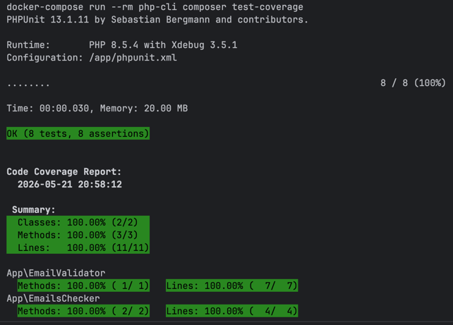

# Покрытие валидатора юнит тестами

Для проверки покрытия тестов:
1. Инициализация
   ```bash
   make init
   ```
2. Проверка тестового покрытия
   ```bash
   make test-coverage
   ```

#### Скриншот с результатами тестового покрытия

